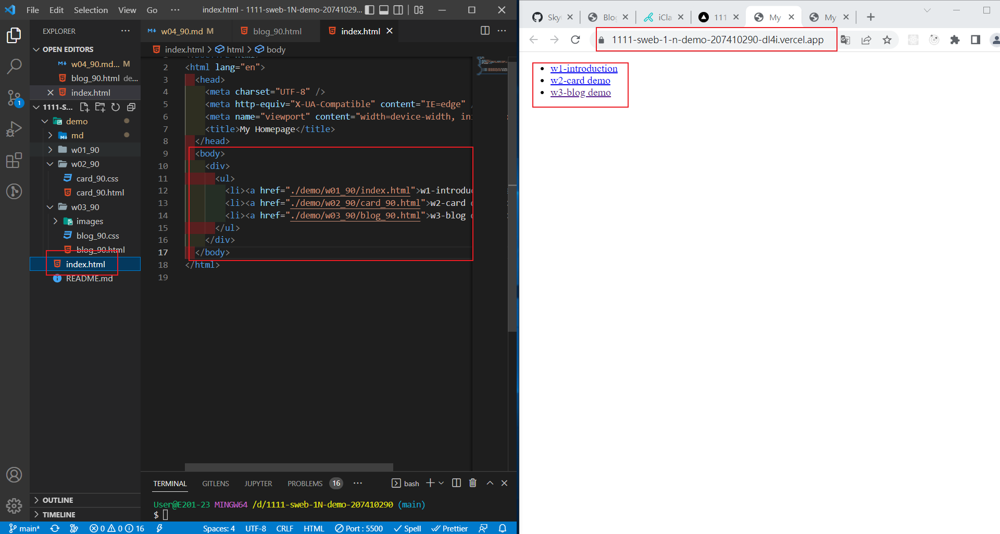
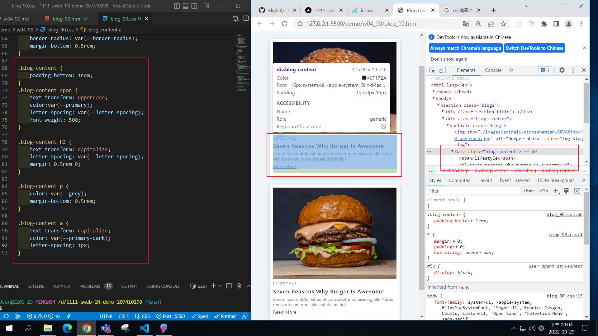
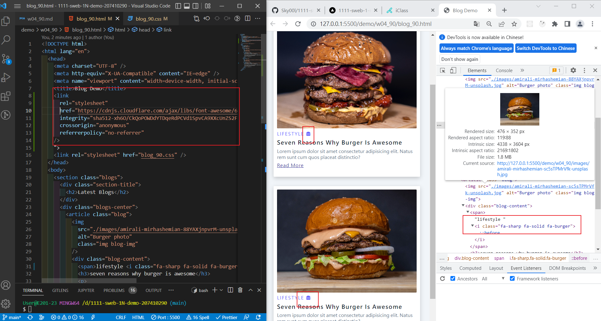
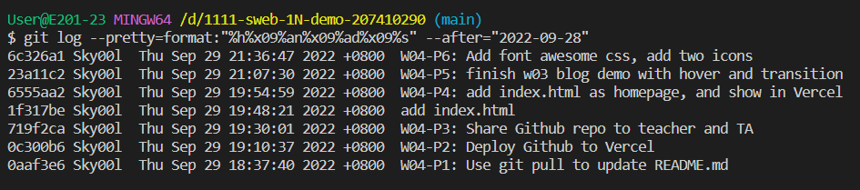

### Github repo url

[My Github repo](https://github.com/Sky00l/1111-sweb-1N-demo-207410290)

### W04-P1: Use git pull to update README.md


### W04-P2: Deploy Github to Vercel


### W04-P3: Share Github repo to teacher and TA


### W04-P4: add index.html as homepage, and show in Vercel



### W04-P5: finish w03 blog demo with hover and transition



### W04-P6: Add font awesome css, add two icons



### W043-P7: All logs



```
$ git log --pretty=format:"%h%x09%an%x09%ad%x09%s" --after="2022-09-28"
6c326a1 Sky00l  Thu Sep 29 21:36:47 2022 +0800  W04-P6: Add font awesome css, add two icons
23a11c2 Sky00l  Thu Sep 29 21:07:30 2022 +0800  W04-P5: finish w03 blog demo with hover and transition
6555aa2 Sky00l  Thu Sep 29 19:54:59 2022 +0800  W04-P4: add index.html as homepage, and show in Vercel
1f317be Sky00l  Thu Sep 29 19:48:21 2022 +0800  add index.html
719f2ca Sky00l  Thu Sep 29 19:30:01 2022 +0800  W04-P3: Share Github repo to teacher and TA
0c300b6 Sky00l  Thu Sep 29 19:10:37 2022 +0800  W04-P2: Deploy Github to Vercel
0aaf3e6 Sky00l  Thu Sep 29 18:37:40 2022 +0800  W04-P1: Use git pull to update README.md

```
