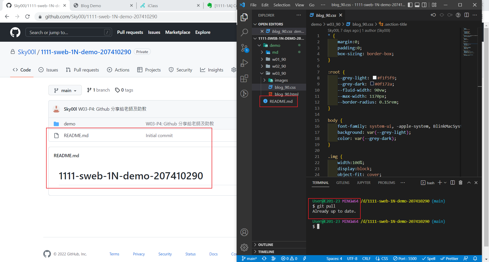
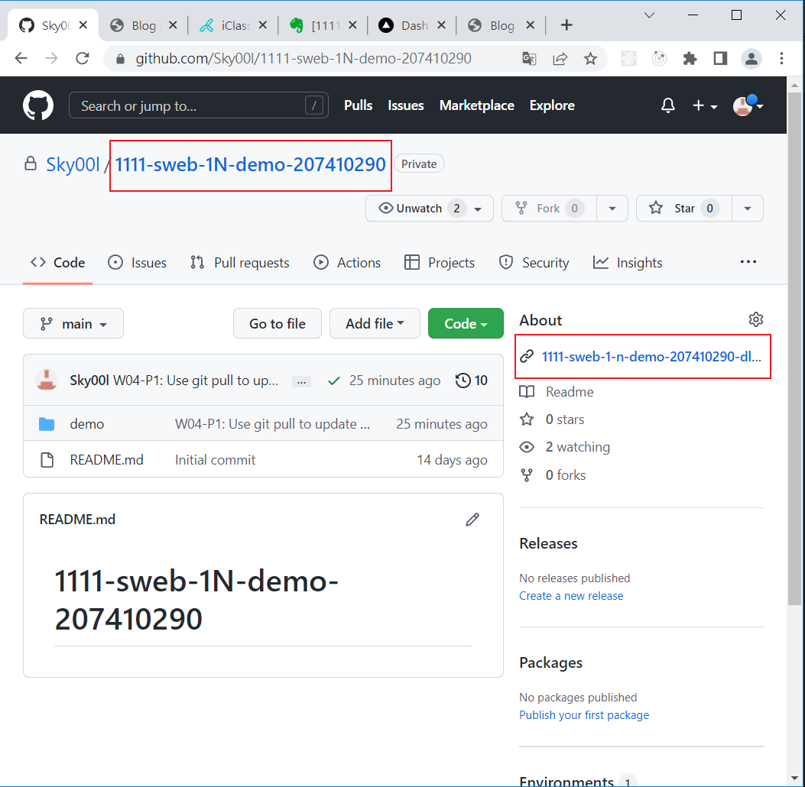
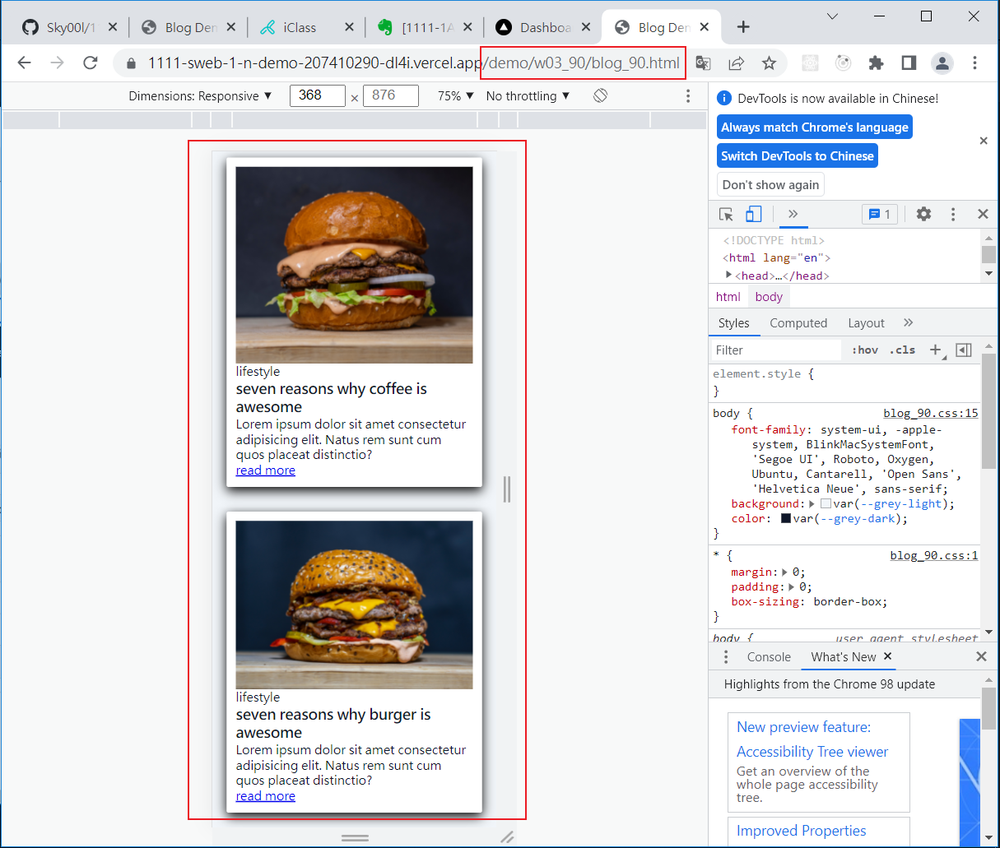
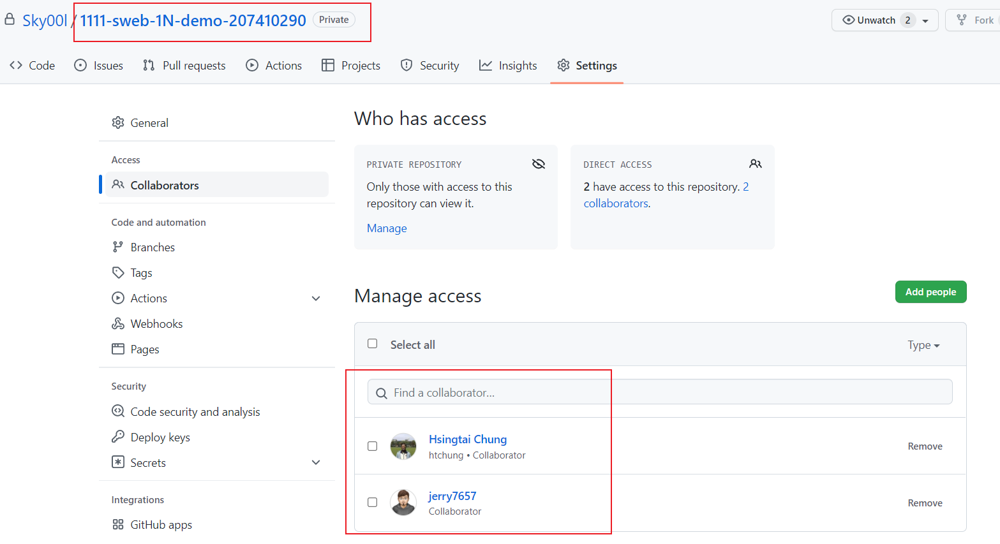

### Github repo url

[My Github repo](https://github.com/Sky00l/1111-sweb-1N-demo-207410290)

### W04-P1: Use git pull to update README.md



### W04-P2: Deploy Github to Vercel





### W04-P3: Share Github repo to teacher and TA



### W03-P4: Github 分享給老師及助教


```
$ git log --pretty=format:"%h%x09%an%x09%ad%x09%s" --after="2022-09-28"
232389f Sky00l  Thu Sep 22 21:30:57 2022 +0800   W3 all logs
4944d75 Sky00l  Thu Sep 22 21:22:56 2022 +0800   W03-P2: Display second blog using Chrome DevTools
874fd2b Sky00l  Thu Sep 22 20:09:03 2022 +0800  W03-P1: Display the image of the first blog with Chrome DevTools

```
