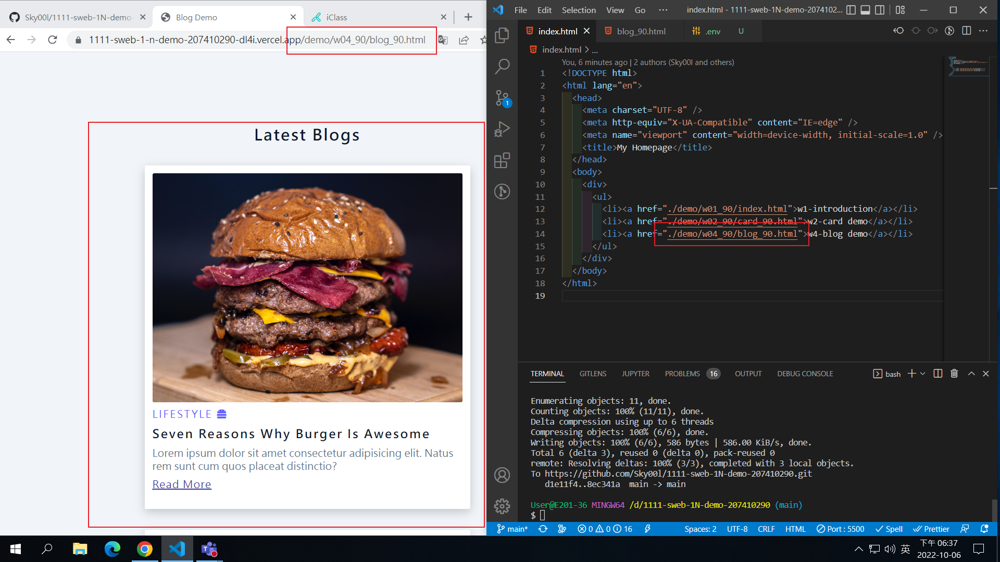
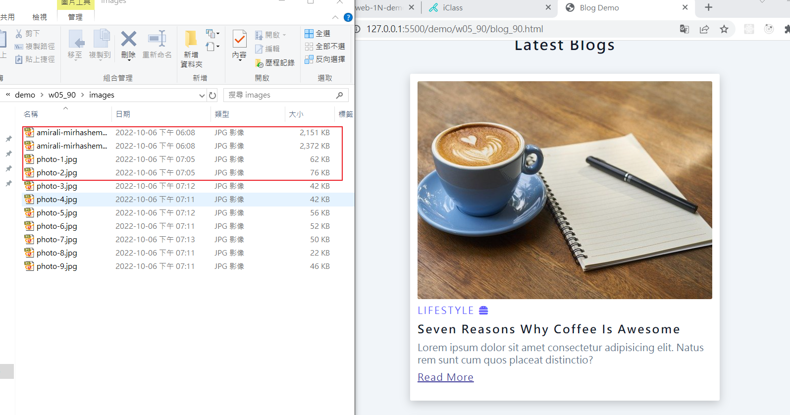
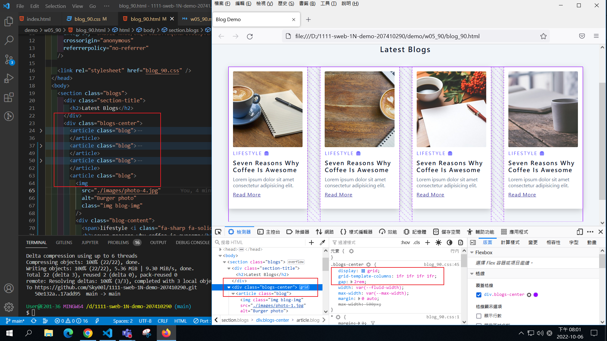
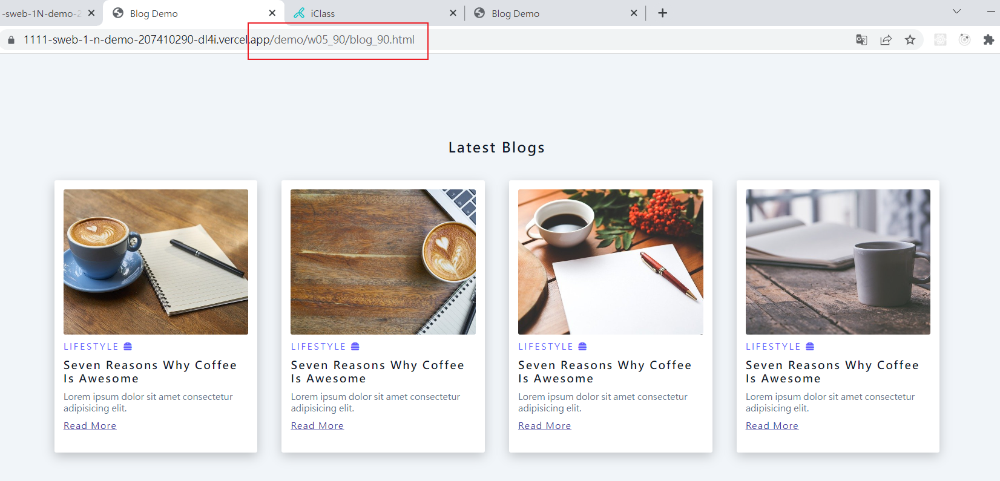
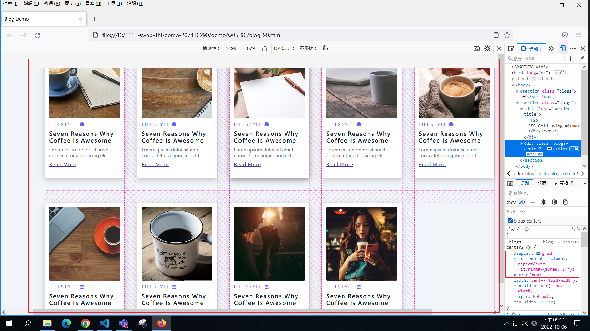
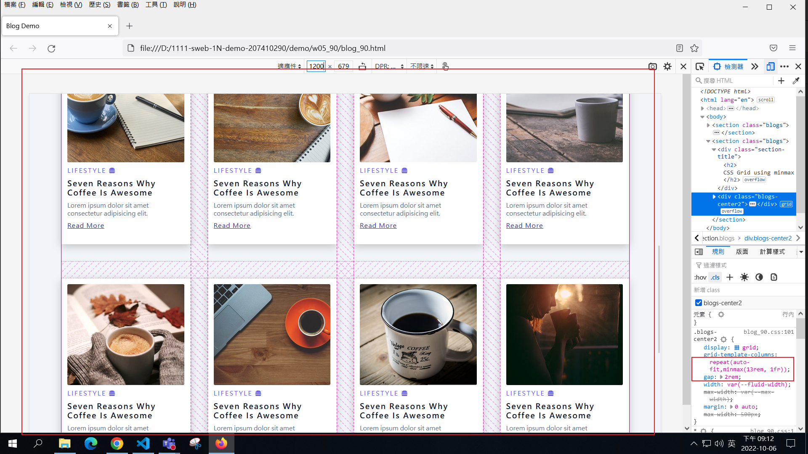
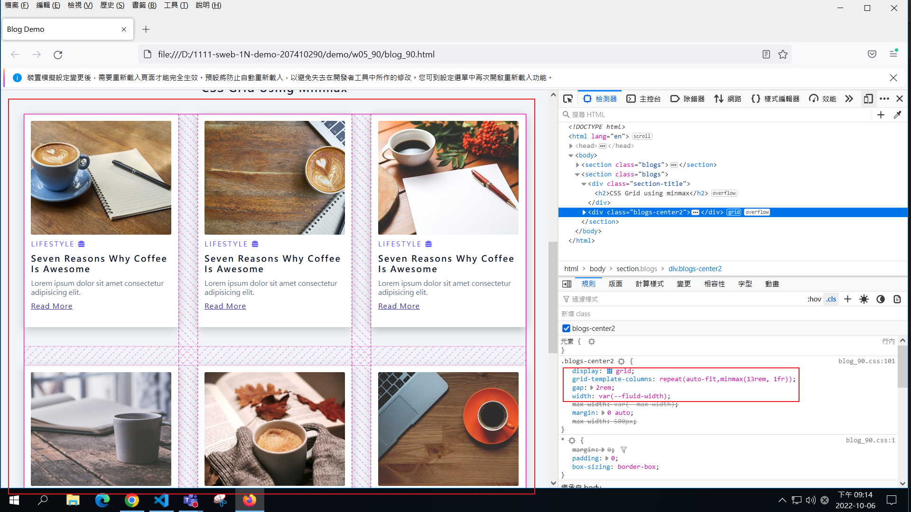
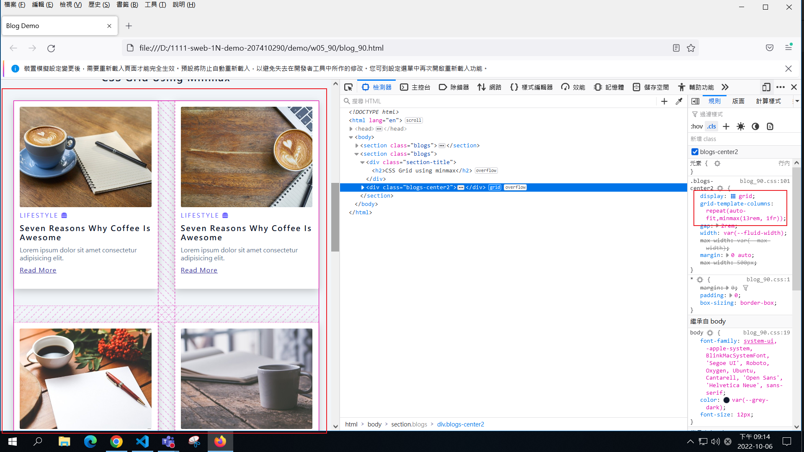

### Github repo url

[My Github repo](https://github.com/Sky00l/1111-sweb-1N-demo-207410290)

### W05-P1: add w04 link in index.html



### W05-P2: get 9 photo using small sizes



### W05-P3: Use grid to show 4 photos in a row



### W05-P4: Add w05 link in index.html, and show it in Vercel



### W05-P5: Using css grid with minmax to display 9 photos










### W04-P6: Add font awesome css, add two icons


### W043-P7: All logs


```
$ git log --pretty=format:"%h%x09%an%x09%ad%x09%s" --after="2022-09-28"


```
