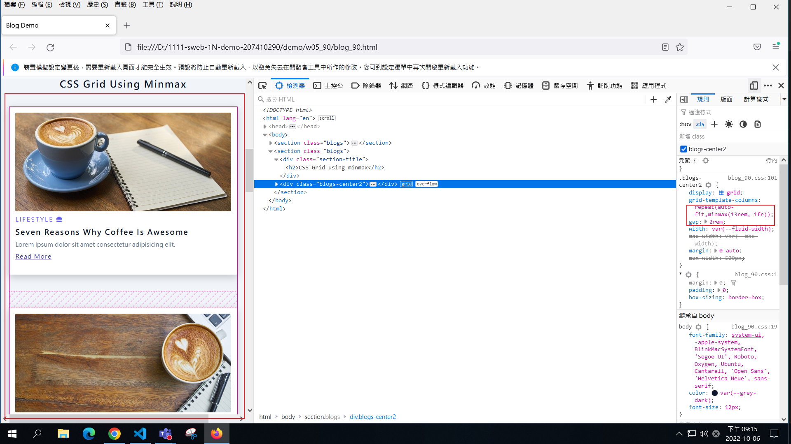

### Github repo url

[My Github repo](https://github.com/Sky00l/1111-sweb-1N-demo-207410290)

### W05-P1: add w04 link in index.html


### W05-P2: get 9 photo using small sizes


### W05-P3: Use grid to show 4 photos in a row


### W05-P4: Add w05 link in index.html, and show it in Vercel


### W05-P5: Using css grid with minmax to display 9 photos




### W05-logs: W5 all logs


```
$ git log --pretty=format:"%h%x09%an%x09%ad%x09%s" --after="2022-10-05"
a585591 Sky00l  Thu Oct 6 21:25:14 2022 +0800   W05-P5: Using css grid with minmax to display 9 photos
084892e Sky00l  Thu Oct 6 20:09:08 2022 +0800   Add w05 link in index.html, and show it in Vercel
e3737bd Sky00l  Thu Oct 6 20:05:39 2022 +0800   W05-P3: Use grid to show 4 photos in a row17add95 Sky00l  Thu Oct 6 19:28:39 2022 +0800   W05-P2: get 9 photo using small sizes
50e132a Sky00l  Thu Oct 6 18:43:09 2022 +0800   W05-P1: add w04 link in index.html
8ec341a Sky00l  Thu Oct 6 18:35:57 2022 +0800   add w04 link to index.html

```
