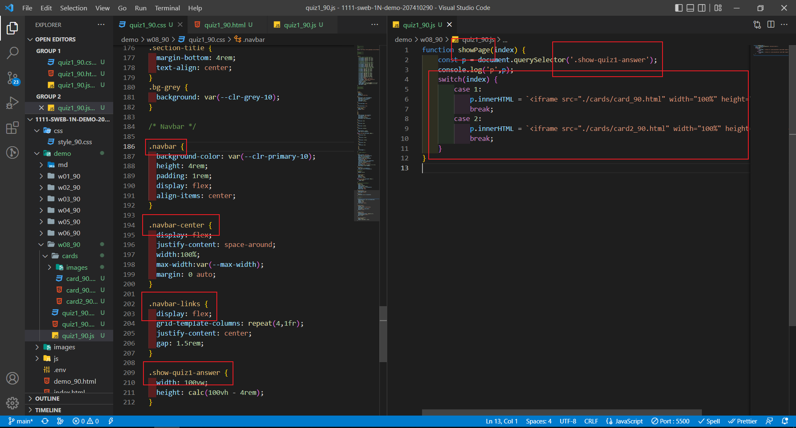
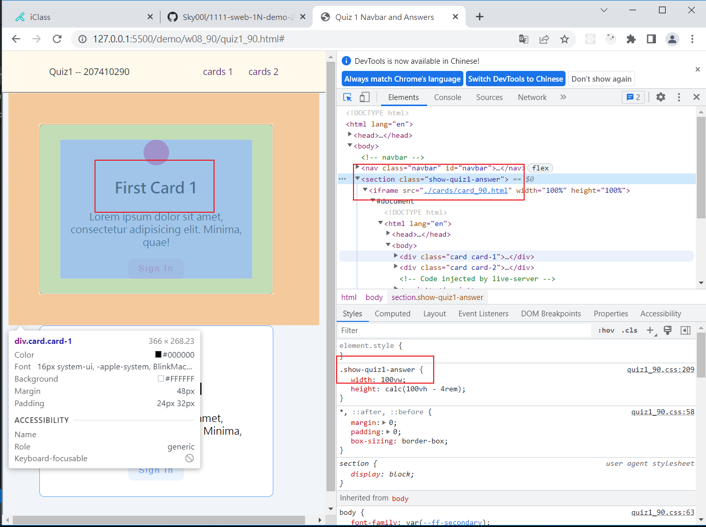
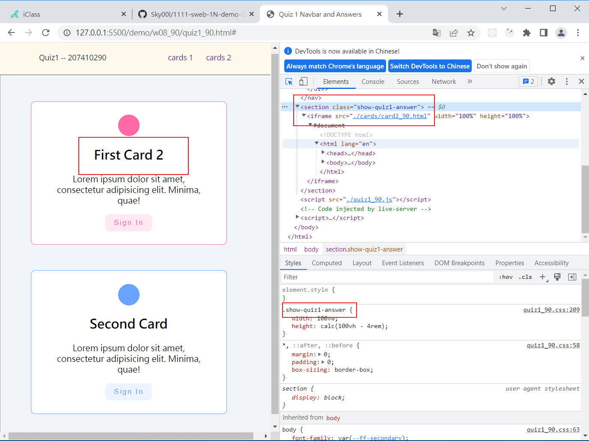
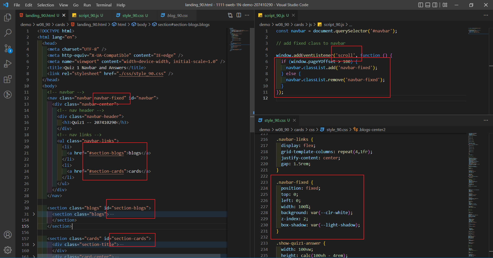
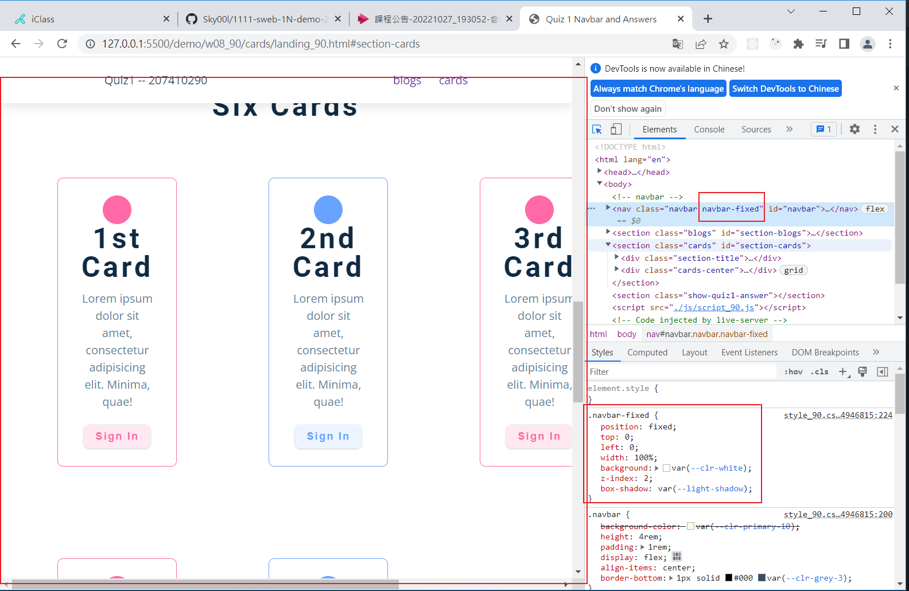

### Github repo url

[My Github repo](https://github.com/Sky00l/1111-sweb-1N-demo-207410290)

### w08-P1: navbar with card1 and card2







### w08-P2: fixed navbar setup and two sections with two links






### W06-P3: run 4 classdemo one by one


### W06-logs: W6 all logs


```
$ git log --pretty=format:"%h%x09%an%x09%ad%x09%s" --after="2022-10-12"
0beb9ec Sky00l  Thu Oct 13 21:26:59 2022 +0800  W06-P3: run 4 classdemo one by one
cad9a06 Sky00l  Thu Oct 13 20:29:55 2022 +0800  W06-P2: add navbar for demo links
05a7b05 Sky00l  Thu Oct 13 19:09:45 2022 +0800  W06-P1: add 3 breakpoints for different devices

```
