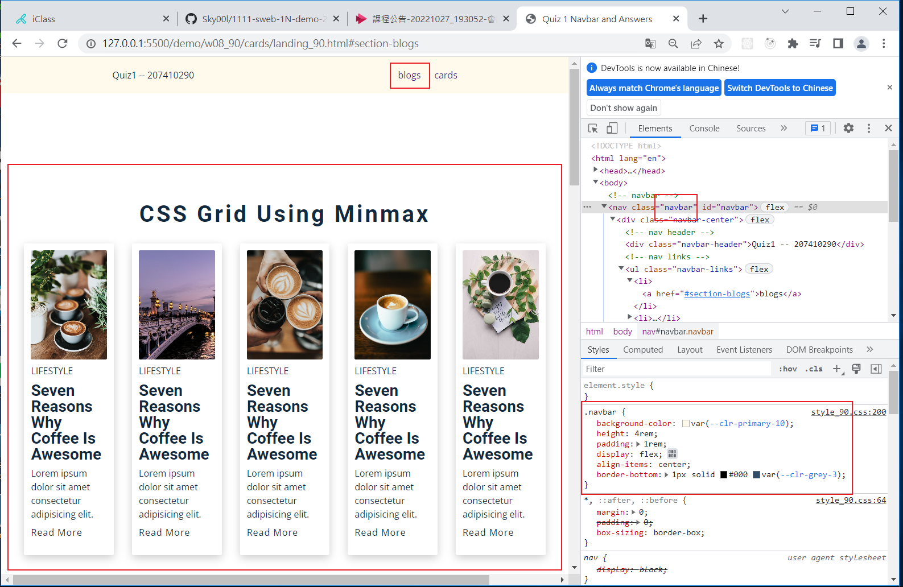

### Github repo url

[My Github repo](https://github.com/Sky00l/1111-sweb-1N-demo-207410290)

### w08-P1: navbar with card1 and card2


### w08-P2: fixed navbar setup and two sections with two links




### w08-P3: define css variables for .btn-1, .btn-2, .btn3


### W08-logs: W8 all logs


```
$ git log --pretty=format:"%h%x09%an%x09%ad%x09%s" --after="2022-10-26"
d8db435 Sky00l  Thu Oct 27 21:44:33 2022 +0800  w08-P3: define css variables for .btn-1, .btn-2, .btn3
5e8da27 Sky00l  Thu Oct 27 20:54:38 2022 +0800  w08-P2: fixed navbar setup and two sections with two links
7e67305 Sky00l  Thu Oct 27 19:00:08 2022 +0800  w08-P1: navbar with card1 and card2

```
