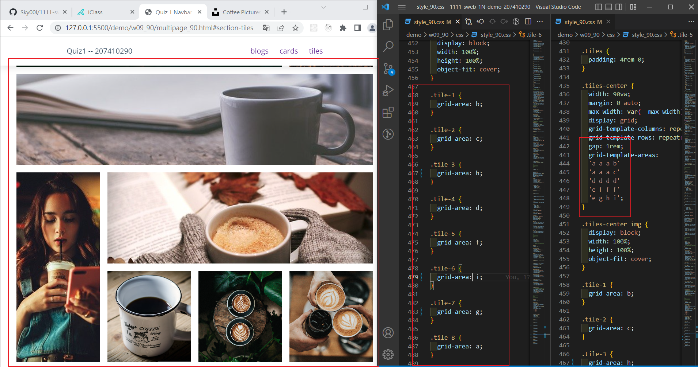

### Github repo url

[My Github repo](https://github.com/Sky00l/1111-sweb-1N-demo-207410290)

### w09-P1: setup tiles menu item with section id


### w09-P2: Show tiles layout of 9 photos



### w09-P3: Resume, show resume-left and resume-right with ratio 30:70


### w09-P4: Resume, show .profile with photo, name, career


### w09-P5: Resume, show about info on resume-right section


### W09-logs: W8 all logs


```
$ git log --pretty=format:"%h%x09%an%x09%ad%x09%s" --after="2022-11-02"

845f761 Sky00l  Thu Nov 3 21:06:03 2022 +0800   w09-P5: Resume, show about info on resume-right section
a122a92 Sky00l  Thu Nov 3 20:55:24 2022 +0800   w09-P4: Resume, show .profile with photo, name, career
ead296c Sky00l  Thu Nov 3 20:14:03 2022 +0800   w09-P3: Resume, show resume-left and resume-right with ratio 30:70
ecf9655 Sky00l  Thu Nov 3 19:39:35 2022 +0800   w09-P2: Show tiles layout of 9 photos
34398ec Sky00l  Thu Nov 3 18:49:24 2022 +0800   w09-P1: setup tiles menu item with section id

```
