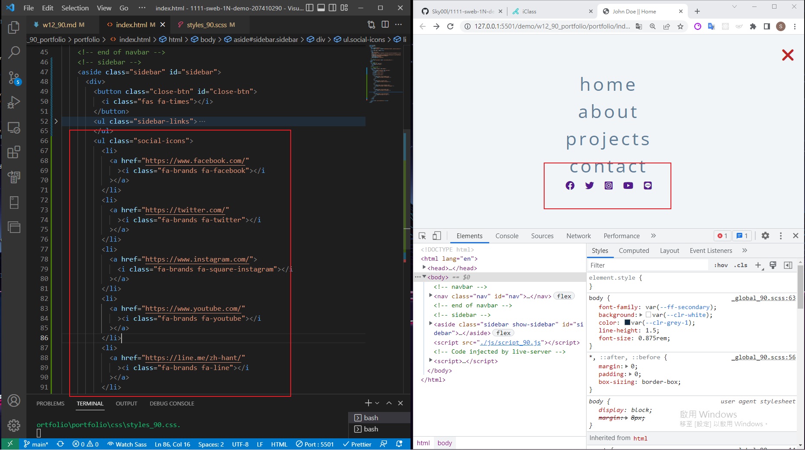
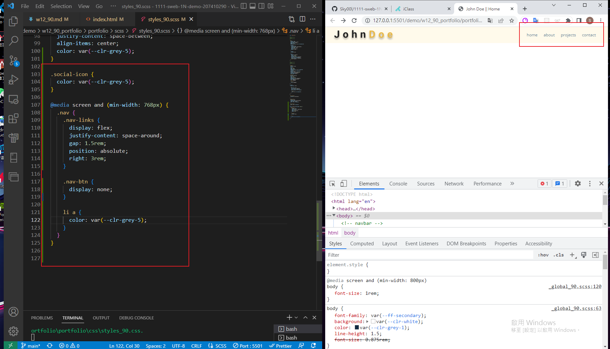
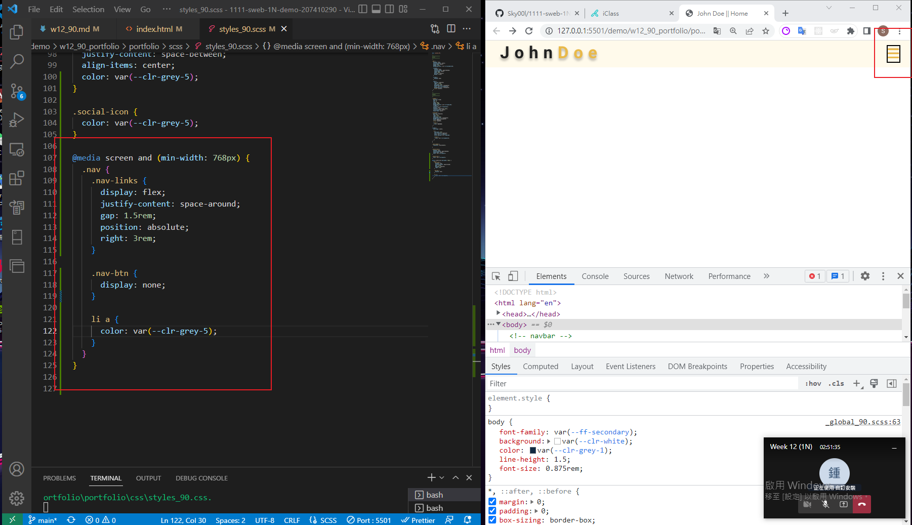
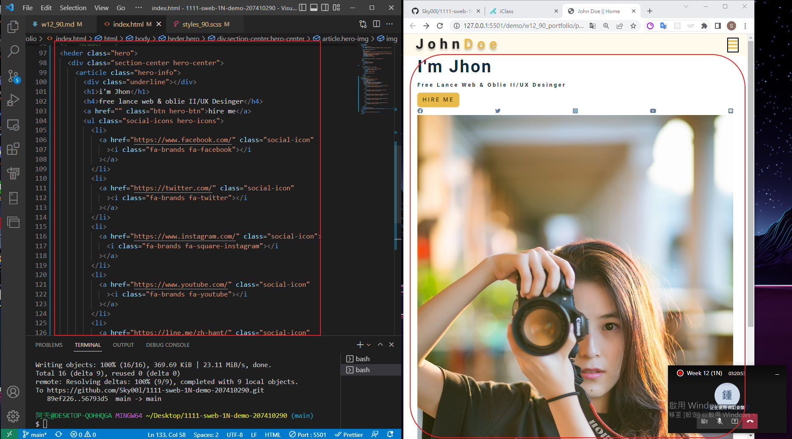
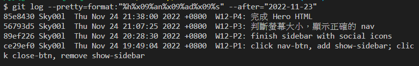

## Github & Vercel URL

[Github URL](https://github.com/Sky00l/1111-sweb-1N-demo-207410290)

[Vercel URL](https://1111-sweb-1-n-demo-207410290-dl4i.vercel.app/)

### W12-P1: click nav-btn, add show-sidebar; click close-btn, remove show-sidebar


### W12-P2: finish sidebar with social icons



### W12-P3: 判斷螢幕大小，顯示正確的 nav





### W12-P4: 完成 Hero HTML



### W12-logs: show all logs of Week 12



```
$ git log --pretty=format:"%h%x09%an%x09%ad%x09%s" --after="2022-11-23"
85e8430 Sky00l  Thu Nov 24 21:38:00 2022 +0800  W12-P4: 完成 Hero HTML
56793d5 Sky00l  Thu Nov 24 21:07:25 2022 +0800  W12-P3: 判斷螢幕大小，顯示正確的 nav
89ef226 Sky00l  Thu Nov 24 20:28:30 2022 +0800  W12-P2: finish sidebar with social icons     
ce29ef0 Sky00l  Thu Nov 24 19:49:04 2022 +0800  W12-P1: click nav-btn, add show-sidebar; click close-btn, remove show-sidebar
```
